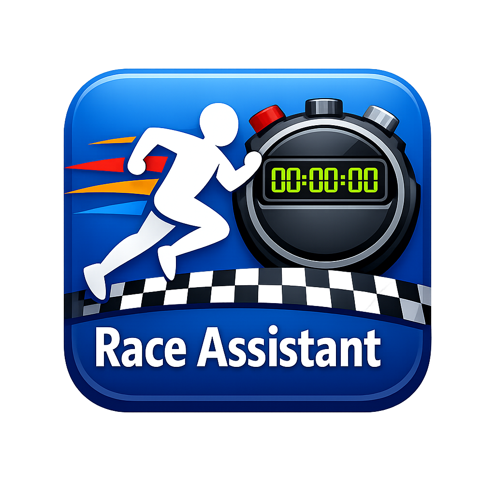
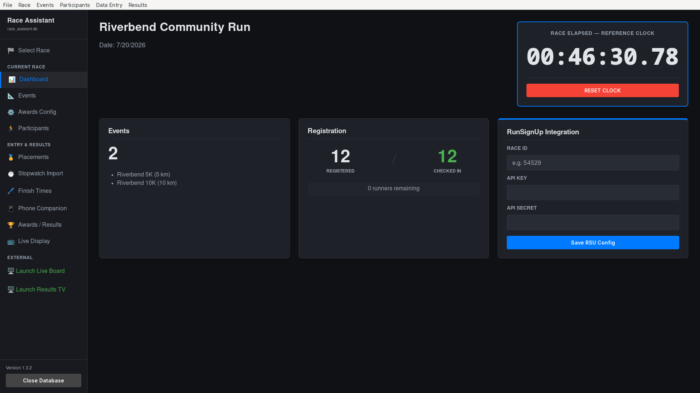
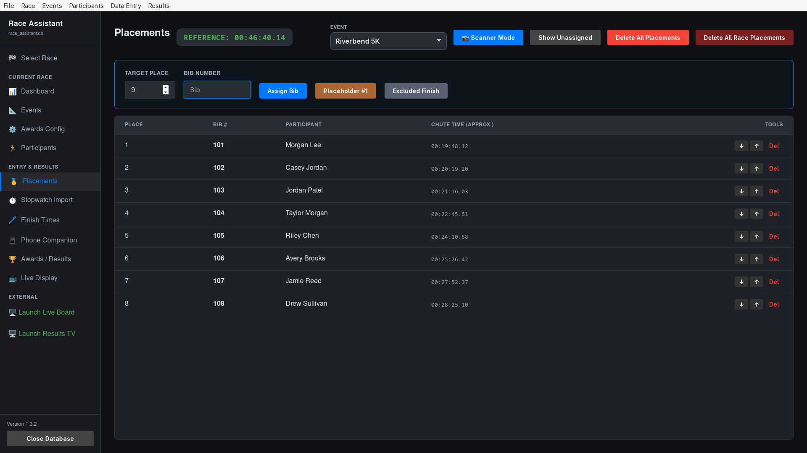
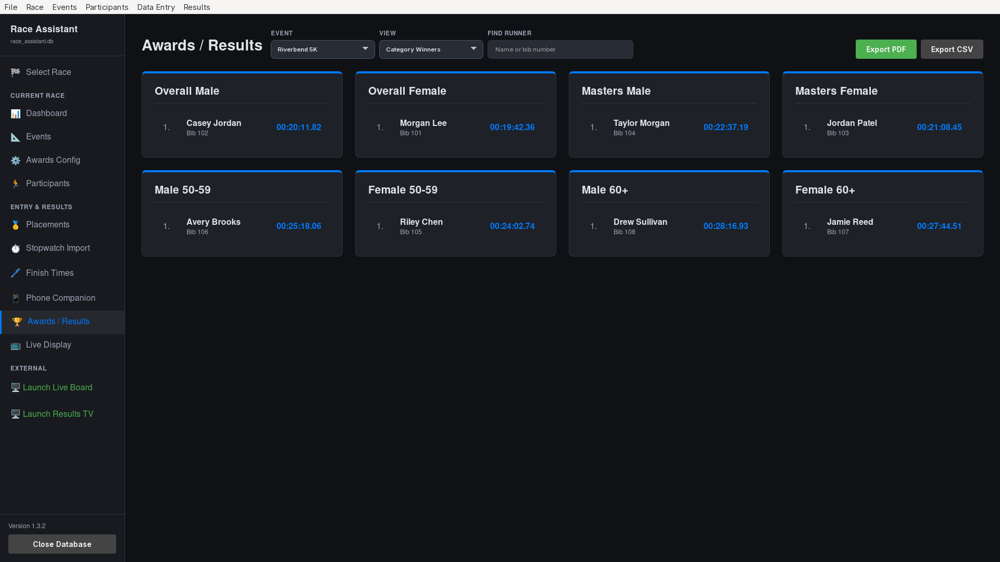
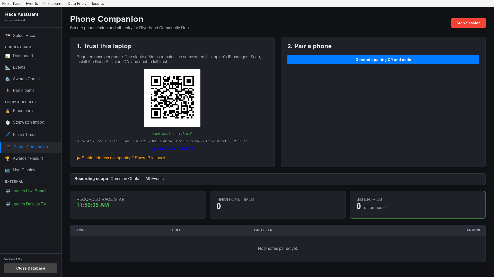
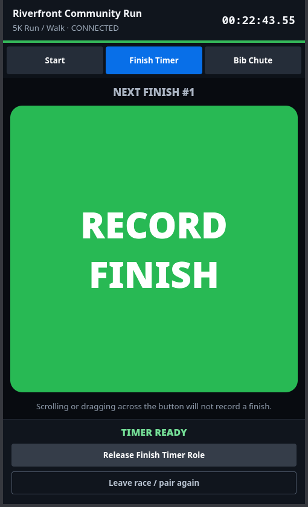
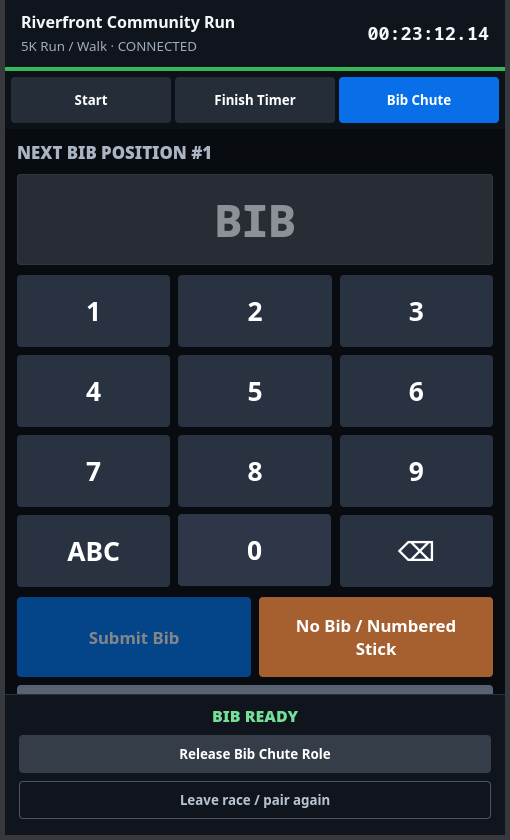

<p align="center">
  
</p>

<h1 align="center">Race Assistant™</h1>

<p align="center">
  Simple, dependable race timing for community events.<br>
  Built for race directors who need results—not a complicated timing platform.
</p>

<p align="center">
  <a href="https://github.com/ssnodgrass/race-assistant/releases/latest"><strong>Download the latest release</strong></a>
  ·
  <a href="https://github.com/ssnodgrass/race-assistant/issues">Report an issue</a>
  ·
  <a href="SUPPORT.md">Support the project</a>
  ·
  <a href="docs/companion-race-day-testing.md">Race-day checklist</a>
</p>

<p align="center">
  <a href="https://github.com/ssnodgrass/race-assistant/releases/latest"></a>
  
  
  
  <a href="LICENSE"></a>
</p>

> [!NOTE]
> **AI-assisted development:** Race Assistant has been developed with substantial assistance from OpenAI Codex, including code generation, review, refactoring, testing, and documentation. AI-generated output is not accepted blindly: the project is human-directed and maintained, changes are reviewed and tested, and the application has been exercised in real race-day scenarios at community events. As with any timing system, race crews should practice their complete workflow and maintain a backup plan before an event.



## Timing should not be the hardest part of putting on a race

Race Assistant is free race-management and timing software designed for local 5Ks, 10Ks, fun runs, and other small events. Its mission is to make a straightforward, open-source timing system available to clubs, schools, nonprofits, and volunteer race crews without requiring expensive hardware or a permanent internet connection.

Create the race, register runners, record finish times and bib order, then produce standings and age-group awards from one desktop application. Race data stays in a portable SQLite database that you control.

## Designed for how finish chutes actually work

Race Assistant keeps **finish times** and **bib placements** as two ordered streams:

1. A timer records each athlete crossing the finish line.
2. A chute worker records bib numbers in finishing order.
3. Race Assistant matches time position 1 with bib position 1, position 2 with position 2, and so on.

That means the timer can concentrate on the line while another volunteer handles bibs farther down the chute. Missing bibs, duplicate runners, numbered sticks, and excluded finishes can be documented without throwing the two streams out of alignment.

## What it can do

- **Race and event setup** — manage multiple distances within a race and configure award groups.
- **Registration and check-in** — add runners manually, import CSV registrations, print bib labels, and optionally connect RunSignUp.
- **Flexible finish capture** — type bibs, use a barcode scanner, import placements, or use the touchscreen-friendly entry screen.
- **Finish-line timing** — enter times manually, download from supported serial stopwatches, import Watchware data, or record from a phone.
- **Phone Companion PWA** — pair one or more phones by secure QR code for Start, Finish Timer, and Bib Chute roles.
- **Resilient local operation** — companion entries queue safely through brief Wi-Fi interruptions and sync when the laptop returns.
- **Live displays** — show recent finishers, approximate chute times, official results, and public standings on another screen.
- **Awards and results** — find runners by name or bib, calculate configurable age-group awards, and export PDF or CSV reports.
- **Portable race files** — each database can be backed up, copied, reopened, and archived with the event.

## A race-day view

<table>
  <tr>
    <td width="50%">
      <br>
      <sub><strong>Bib order:</strong> fast entry, placeholders, excluded finishes, and approximate chute times.</sub>
    </td>
    <td width="50%">
      <br>
      <sub><strong>Awards and results:</strong> searchable finishers, category winners, and PDF/CSV export.</sub>
    </td>
  </tr>
</table>

### Use the equipment that fits your event

| Workflow | Best for | How it works |
| --- | --- | --- |
| Keyboard, touchscreen, or barcode scanner | A single operator or smaller field | Enter each bib directly at the laptop. |
| Dedicated stopwatch | A familiar, hardware-first timing workflow | Record on the stopwatch, then download over serial or import its Watchware file. |
| Phone Companion | A two-person finish crew or a remote starting line | One phone records finish times while another records bib order; Start can be captured offline and synced afterward. |
| Mixed workflow | Extra redundancy | Combine phone timing, manual corrections, stopwatch imports, and laptop entry in the same race. |

## Phone Companion



The companion is an installable local web app—there is no separate app-store download. The laptop creates a private HTTPS service on the race network and displays the QR codes needed to trust and pair each phone.

- Assign an exclusive **Start**, **Finish Timer**, or **Bib Chute** role to each phone.
- Capture the official start away from the laptop after calibrating on the race network.
- Keep recording during short network interruptions; queued entries remain on the phone until acknowledged.
- Review the local queue, retry synchronization, release roles, and pair the phone with another race session.
- Use the stable `race-assistant.local` address with the displayed IP address as a fallback.

<table>
  <tr>
    <td width="50%">
      <br>
      <sub><strong>Finish Timer:</strong> one deliberate tap captures the next official finish time.</sub>
    </td>
    <td width="50%">
      <br>
      <sub><strong>Bib Chute:</strong> enter bib order or preserve the sequence with a placeholder.</sub>
    </td>
  </tr>
</table>

For a two-phone setup and complete acceptance test, follow the [Phone Companion race-day checklist](docs/companion-race-day-testing.md). The [architecture and safeguards document](docs/companion-architecture.md) explains role leases, local storage, clock calibration, and recovery behavior.

## Getting started

1. Open the [latest release](https://github.com/ssnodgrass/race-assistant/releases/latest).
2. Download the Windows 64-bit ZIP or Linux amd64 archive and extract it.
3. Start Race Assistant and create a new `.db` race database.
4. Create the race and its events, then configure age groups and awards.
5. Add participants manually or import a registration CSV.
6. Choose the timing workflow you plan to use and run a short practice finish before race day.

Release builds are currently unsigned, so Windows or Linux may ask you to confirm that you trust the downloaded application. Keep the race database and a backup somewhere easy to find. The core timing workflow is local-first and does not require cloud access.

> [!IMPORTANT]
> Practice the complete workflow before race day: start, several finish captures, bib entries, an intentional placeholder, results review, export, and database backup. If using phones, also test an offline capture and reconnection.

## Documentation

- [Phone Companion race-day testing](docs/companion-race-day-testing.md)
- [Phone Companion architecture and safeguards](docs/companion-architecture.md)
- [Stopwatch timing-import troubleshooting](docs/timing-import-debugging.md)
- [Watchware upload format](docs/watchware-stopwatch-upload-format.md)

## Contributing

Bug reports, race-day observations, documentation improvements, and focused pull requests are welcome. When reporting a timing issue, include the Race Assistant version, operating system, timing workflow, and the sequence of actions that produced it. Do not attach a race database containing participant information to a public issue.

## Support the project

Race Assistant is free software, but maintaining dependable race-day software still takes time, equipment, code signing, and careful testing. If the project helps your event, see [ways to support Race Assistant](SUPPORT.md) for the planned GitHub Sponsors tiers, focused contribution ideas, and other ways to help. The Sponsor button will appear on this repository after the GitHub Sponsors profile is approved and published.

Sponsorship supports the project; it does not buy roadmap control, guaranteed support, endorsement, or trademark rights. Paid race timing, setup assistance, and custom development are separate services when available.

## License and trademarks

Copyright © 2026 Scott Snodgrass. Race Assistant is free software licensed under the [GNU Affero General Public License, version 3 or later](LICENSE). You may use it commercially, modify it, and redistribute it under the license's terms. Distributions must provide the corresponding source, and modified versions used over a network must offer their corresponding source to those users. The corresponding source for every official release is available from that release's tag in this repository.

The software license does not grant rights to the Race Assistant name or logo. The **Race Assistant™** name and official logo identify this project and are covered by the [Race Assistant Trademark Policy](TRADEMARKS.md). Forks are welcome, but public modified versions should use their own name and branding and must not imply that they are official releases.

<details>
<summary><strong>Developer setup and build commands</strong></summary>

### Technology

- Go
- Wails v3
- React and TypeScript
- SQLite

### Prerequisites

Install Go, Node.js with npm, and `wails3`. The `task` command is optional.

### First-time setup

```bash
cd frontend
npm install
cd ..
wails3 generate bindings -clean=true -ts
```

### Development

```bash
wails3 dev -config ./build/config.yml
```

Or, with Task:

```bash
task dev
```

### Test and build

```bash
go test ./...
cd frontend && npm test -- --run && npm run build && cd ..
wails3 build
```

Run the frontend separately:

```bash
cd frontend
npm run dev -- --port 9245 --strictPort
```

Regenerate Wails bindings after changing a bound Go service or model:

```bash
wails3 generate bindings -clean=true -ts
```

For low-level serial diagnostics:

```bash
go run ./cmd/serialtap -port COM4 -baud 4800
```

</details>
